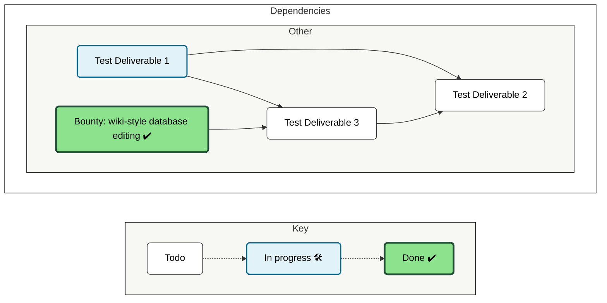

## Dependency diagram

Here are the dependencies amongst deliverables:

```mermaid

flowchart LR

  %% ─────────────────────────────
  %% Styles
  %% ─────────────────────────────
  classDef default fill:#fff,stroke:#333,stroke-width:1px,color:#000,rx:5,ry:5
  classDef InProgress fill:#e1f3f8,stroke:#07648d,stroke-width:2px,color:#000
  classDef Done fill:#8DE28D,stroke:#204e34,stroke-width:3px,color:#000
  style Canvas fill:transparent,stroke:#171716
  style Legend fill:#F7F7F4,stroke:#171716
  style other fill:#F7F7F4,stroke:#171716

  %% ─────────────────────────────
  %% Legend
  %% ─────────────────────────────
  subgraph Legend["Key"]
    direction LR
    k1["Todo"]
    k2["In progress 🛠️ "]:::InProgress
    k3["Done ✔️"]:::Done

    k1 -.-> k2 -.-> k3
  end

  %% ─────────────────────────────
  %% Main canvas
  %% ─────────────────────────────
  subgraph Canvas["Dependencies"]
    direction LR


    subgraph other["Other"]
    direction LR
        simpler-coop/simpler-template#1["Test Deliverable 1"]:::InProgress
        simpler-coop/simpler-template#3["Test Deliverable 2"]
        simpler-coop/simpler-template#4["Bounty: wiki-style database editing ✔️"]:::Done
        simpler-coop/simpler-template#10["Test Deliverable 3"]
    end


    %% ─────────────────────────────
    %% Relationships
    %% ─────────────────────────────
    simpler-coop/simpler-template#1 --> simpler-coop/simpler-template#10
    simpler-coop/simpler-template#1 --> simpler-coop/simpler-template#3
    simpler-coop/simpler-template#4 --> simpler-coop/simpler-template#10
    simpler-coop/simpler-template#10 --> simpler-coop/simpler-template#3

  end

```
