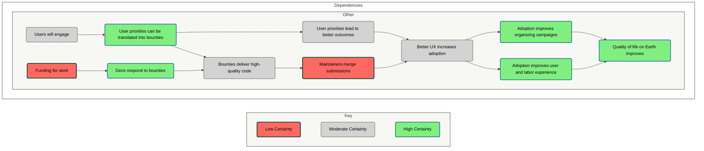

```mermaid

flowchart LR

  %% ─────────────────────────────
  %% Styles
  %% ─────────────────────────────
  classDef default fill:#D3D3D3,stroke:#333,stroke-width:1px,color:#000,rx:5,ry:5
  classDef HighCertainty fill:#80EF80,stroke:#07648d,stroke-width:2px,color:#000
  classDef LowCertainty fill:#FF6961,stroke:#204e34,stroke-width:3px,color:#000
  style Canvas fill:transparent,stroke:#171716
  style Legend fill:#F7F7F4,stroke:#171716
  style other fill:#F7F7F4,stroke:#171716

  %% ─────────────────────────────
  %% Legend
  %% ─────────────────────────────
  subgraph Legend["Key"]
    direction LR
    k3["Low Certainty"]:::LowCertainty
    k1["Moderate Certainty"]
    k2["High Certainty"]:::HighCertainty

    %% Invisible links to force horizontal alignment
    k3 ~~~ k1 ~~~ k2
  end

  %% ─────────────────────────────
  %% Main canvas
  %% ─────────────────────────────
  subgraph Canvas["Dependencies"]
    direction LR

    subgraph other["Other"]
    direction LR
        users["Users will engage"]
        userPriorities["User priorities lead to better outcomes"]
        translate["User priorities can be translated into bounties"]:::HighCertainty
        funding["Funding for work"]:::LowCertainty
        developers["Devs respond to bounties"]:::HighCertainty
        quality["Bounties deliver high-quality code"]
        merge["Maintainers merge submissions"]:::LowCertainty
        uxAdoption["Better UX increases adoption"]
        politics["Adoption improves organizing campaigns"]:::HighCertainty
        userJoy["Adoption improves user and labor experience"]:::HighCertainty
        material["Quality of life on Earth improves"]:::HighCertainty
    end


    %% ─────────────────────────────
    %% Relationships
    %% ─────────────────────────────
    users --> translate
    translate --> quality
    translate --> userPriorities --> uxAdoption
    funding --> developers 
    developers --> quality 
    quality --> merge 
    merge --> uxAdoption 
    uxAdoption --> politics
    uxAdoption --> userJoy
    politics --> material
    userJoy --> material
  end

```
